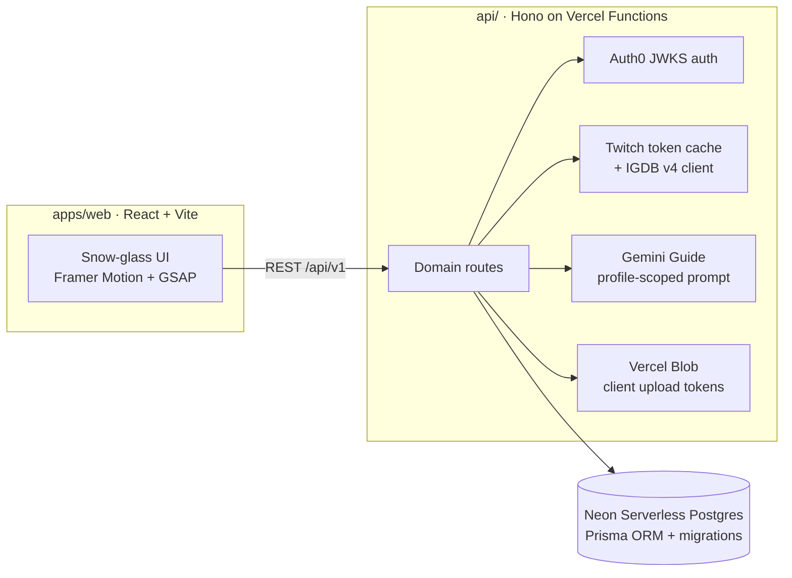

<div align="center">

# ▶ SavePoint

**A collectible gaming portfolio. Not a feed.**

Your rig, your Hall of Fame, every save that stayed with you, presented like the museum exhibit it deserves to be.

[](https://github.com/GautamVhavle/SavePoint/actions/workflows/ci.yml)
[](LICENSE)
[](apps/web)
[](https://savepointarchive.vercel.app)

</div>

---

SavePoint is a public portfolio page for players: an art-directed archive of the games you finished, dropped, and never stopped thinking about, the machine you play on, the awards you invent for yourself, and a profile-scoped AI Guide that answers questions **using only your archive**.

There are no follows, likes, comments, or timelines. One link in your bio does the talking.

## Highlights

| Area | What you get |
| --- | --- |
| Public archive | Cinematic masthead with GSAP entrance, Hall of Fame cards with holographic edges, filterable chronicle, card dossiers with IGDB key art and official descriptions |
| Studio | Full editors for profile identity, rig + monitors + peripherals, game entries (IGDB search-as-you-type), custom awards, featured curation |
| AI Guide | Gemini-powered answers constrained to the viewed profile, rate-limited per visitor + profile via hashed keys |
| Metadata | Crawler-visible per-profile Open Graph HTML (bot-user-agent rewrite), 1200x630 share cards resolving to the curator's best artwork, sitemap, manifest |
| Trust | Auth0 JWT (JWKS, unknown-kid refresh), ownership checks on every mutation, enforced CSP with pinned inline-script hash, request-body/media-type guards, rate limits on Guide/search/uploads, half-star rating constraints enforced in the database |
| Quality | 24 Playwright tests (smoke, axe WCAG scans, CSP enforcement, studio flows, responsive overflow gates, visual baselines), 61 API tests run against a real Postgres, 68 web unit/contract tests, strict TypeScript, zero-warning ESLint |

## Architecture



## Quick start

Prereqs: Node 22+, pnpm 10+. That is the whole list — the API and the SPA are one Vercel deployment.

```bash
pnpm install
pnpm dev          # `vercel dev` runs the SPA and /api/v1 together on one port
```

With no `DATABASE_URL` the web app falls back to bundled demo data, so `pnpm --dir apps/web dev` alone is enough to explore the UI.

Explore without any accounts at `/u/nova`. The studio works locally too: demo mode persists edits to `localStorage` through the exact same `SavepointClient` contract the live API uses.

### Full-stack local run

Point `DATABASE_URL` at any Postgres (a local container or a Neon branch), then:

```bash
echo 'DATABASE_URL=postgresql://…' >> .env.local
echo 'DEV_AUTH_BYPASS=true'       >> .env.local

pnpm db:deploy     # apply migrations
pnpm db:seed       # creates @alex: rig, games, award
pnpm dev           # open http://localhost:3000/u/alex
```

`DEV_AUTH_BYPASS` is refused outside development/test environments. Production always requires real Auth0 tokens.

## Environment reference

Copy `.env.example` files to `.env.local` and fill what you need. Everything degrades safely without credentials: IGDB search and the Guide return explicit 503s while every other feature stays live.

| Variable | App | Required | Purpose |
| --- | --- | --- | --- |
| `VITE_API_URL` | web | live mode | Base path of the API (`/api/v1`) |
| `VITE_DEMO_MODE` | web | no | Force showcase mode even when an API URL exists |
| `AUTH0_DOMAIN` / `AUTH0_AUDIENCE` | api | prod | JWT validation |
| `DATABASE_URL` | api | yes | Pooled Neon connection string |
| `DATABASE_URL_UNPOOLED` | api | migrations | Direct connection used by `prisma migrate` |
| `IP_HASH_SECRET` | api | prod | HMAC key for privacy-preserving rate-limit keys |
| `TWITCH_CLIENT_ID` / `TWITCH_CLIENT_SECRET` | api | IGDB | Client-credentials token for IGDB v4 |
| `IGDB_RATE_LIMIT` | api | no | Authenticated search calls per profile+visitor per hour window (default 60) |
| `GUIDE_RATE_LIMIT` / `GUIDE_RATE_WINDOW_SECONDS` | api | no | Guide questions per profile+visitor window (default 10 per 3600s) |
| `UPLOAD_RATE_LIMIT` | api | no | Signed upload URLs per profile+visitor per window (default 30) |
| `GEMINI_API_KEY`, `GEMINI_MODEL` | api | Guide | Google GenAI access, model defaults to a current Flash tier |
| `BLOB_READ_WRITE_TOKEN` | api | uploads | Vercel Blob store credential used to mint client upload tokens |
| `SAVEPOINT_API_URL`, `SITE_URL` | functions | deploy | Server-side OG metadata + share cards |
| `CORS_ORIGINS` | api | prod | JSON array of allowed browser origins |

## Testing

```bash
pnpm test            # web unit + contract fixture captured from a live response
pnpm test:e2e        # smoke, axe WCAG A/AA, studio flows, responsive gates, visual baselines
pnpm test:api        # Hono suite (auth, ownership, DB constraints, rate limits, uploads)
pnpm check           # lint + typecheck + web tests + API tests + build in one gate
```

Visual baselines are curated on macOS; other platforms skip unless `PLAYWRIGHT_UPDATE_SNAPSHOTS=1`.

## Deployment

The SPA, the API, the database, and media storage all live in **one Vercel project** on the free Hobby plan.

1. **Database**: add a Neon Postgres integration from the Vercel Marketplace. It injects `DATABASE_URL` and `DATABASE_URL_UNPOOLED` automatically.
2. **Storage**: create a public Vercel Blob store. It injects `BLOB_READ_WRITE_TOKEN`.
3. **Secrets**: set `AUTH0_DOMAIN`, `AUTH0_AUDIENCE`, `IP_HASH_SECRET`, `TWITCH_CLIENT_ID`/`TWITCH_CLIENT_SECRET`, `GEMINI_API_KEY`, and `SITE_URL`.
4. **Deploy**: `vercel --prod`. The build runs `prisma generate`, applies `prisma migrate deploy` on production, then builds the SPA. `vercel.json` rewrites `/api/v1/*` to the Hono function, excludes bot user-agents from the SPA rewrite, and ships the share-card function.

## Roadmap

- `/explore`: public directory of archives so players discover each other
- Import from Steam/PSN to beat the blank-page problem
- Share-card themes per profile; printable year-in-saves export

## Contributing

PRs welcome! Start with [CONTRIBUTING.md](CONTRIBUTING.md) for setup, conventions, and the definition of done. Threat model and control inventory: [docs/security-posture.md](docs/security-posture.md). Reporting: [SECURITY.md](SECURITY.md); please do not open public issues for them.

## License

[MIT](LICENSE) © Gautam Vhavle
