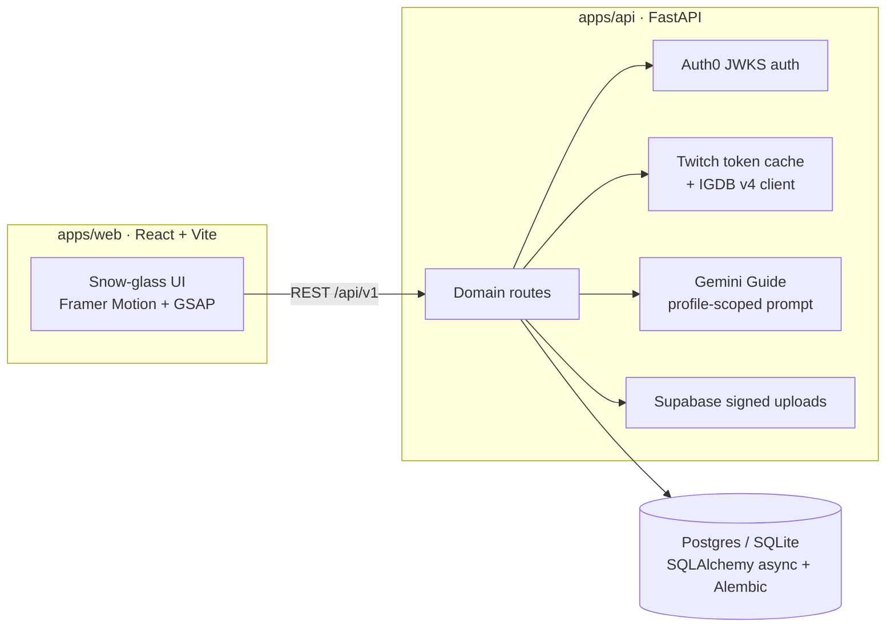

<div align="center">

# ▶ SavePoint

**A collectible gaming portfolio. Not a feed.**

Your rig, your Hall of Fame, every save that stayed with you, presented like the museum exhibit it deserves to be.

[](https://github.com/GautamVhavle/SavePoint/actions/workflows/ci.yml)
[](LICENSE)
[](apps/web)
[](apps/api)

</div>

---

SavePoint is a public portfolio page for players: an art-directed archive of the games you finished, dropped, and never stopped thinking about, the machine you play on, the awards you invent for yourself, and a profile-scoped AI Guide that answers questions **using only your archive**.

There are no follows, likes, comments, or timelines. One link in your bio does the talking.

## Highlights

| Area | What you get |
| --- | --- |
| Public archive | Cinematic masthead with GSAP entrance, Hall of Fame cards with holographic edges, filterable chronicle, card dossiers with IGDB key art and official descriptions |
| Studio | Full editors for profile identity, rig + monitors + peripherals, game entries (IGDB search-as-you-type), custom awards, featured curation |
| AI Guide | Gemini-powered answers constrained to the viewed profile, rate-limited per visitor + profile via hashed keys |
| Metadata | Crawler-visible per-profile Open Graph HTML (bot-user-agent rewrite), dynamic 1200x630 share cards via `@vercel/og`, sitemap, manifest |
| Trust | Auth0 JWT (JWKS, unknown-kid refresh), ownership checks on every mutation, half-star rating constraints enforced in the database |
| Quality | 20 Playwright tests (smoke, axe WCAG scans, studio flows, responsive overflow gates, visual baselines), 20 API tests, 33 web unit/contract tests, strict mypy, zero-warning ESLint |

## Architecture



## Quick start

Prereqs: Node 22, pnpm 11, Python 3.12, [uv](https://docs.astral.sh/uv/).

```bash
# Web (demo data when VITE_API_URL is unset)
pnpm install && pnpm dev

# API
uv sync --project apps/api --all-extras
cd apps/api
uv run alembic upgrade head
uv run uvicorn app.main:app --reload
```

Explore without any accounts at `/u/nova`. The studio works locally too: demo mode persists edits to `localStorage` through the exact same `SavepointClient` contract the live API uses.

### Full-stack local run (zero credentials)

```bash
cd apps/api
export DATABASE_URL="sqlite+aiosqlite:///./savepoint-live.db"
export DEV_AUTH_BYPASS=true
export CORS_ORIGINS='["http://localhost:5174","http://127.0.0.1:5174"]'
uv run alembic upgrade head
uv run python -m app.seed          # creates @alex: rig, games, award
uv run uvicorn app.main:app --port 8000

# second terminal
cd apps/web
VITE_API_URL=http://127.0.0.1:8000/api/v1 pnpm dev --port 5174   # open /u/alex
```

`DEV_AUTH_BYPASS` is refused outside development/test environments. Production always requires real Auth0 tokens.

## Environment reference

Copy `apps/*/.env.example` to `.env` and fill what you need. Everything degrades safely without credentials: IGDB search and the Guide return explicit 503s while every other feature stays live.

| Variable | App | Required | Purpose |
| --- | --- | --- | --- |
| `VITE_API_URL` | web | live mode | Base URL of the FastAPI service (`/api/v1`) |
| `VITE_DEMO_MODE` | web | no | Force showcase mode even when an API URL exists |
| `VITE_SUPABASE_URL` / `VITE_SUPABASE_BUCKET` | web | uploads | Public media base for uploaded images |
| `AUTH0_DOMAIN` / `AUTH0_AUDIENCE` | api | prod | JWT validation |
| `DATABASE_URL` | api | yes | Postgres (Supabase) or SQLite for local |
| `IP_HASH_SECRET` | api | prod | HMAC key for privacy-preserving rate-limit keys |
| `TWITCH_CLIENT_ID` / `TWITCH_CLIENT_SECRET` | api | IGDB | Client-credentials token for IGDB v4 |
| `IGDB_RATE_LIMIT` | api | no | Authenticated search calls per profile+visitor per hour window (default 60) |
| `GUIDE_RATE_LIMIT` / `GUIDE_RATE_WINDOW_SECONDS` | api | no | Guide questions per profile+visitor window (default 10 per 3600s) |
| `UPLOAD_RATE_LIMIT` | api | no | Signed upload URLs per profile+visitor per window (default 30) |
| `GEMINI_API_KEY`, `GEMINI_MODEL` | api | Guide | Google GenAI access, model defaults to a current Flash tier |
| `SUPABASE_URL`, `SUPABASE_SERVICE_KEY`, `SUPABASE_BUCKET` | api | uploads | Signed upload URLs |
| `SAVEPOINT_API_URL`, `SITE_URL` | web functions | deploy | Server-side OG metadata + share cards |
| `CORS_ORIGINS` | api | prod | JSON array of allowed browser origins |

## Testing

```bash
pnpm test            # web unit + contract fixture captured from a live response
pnpm test:e2e        # smoke, axe WCAG A/AA, studio flows, responsive gates, visual baselines
pnpm test:api        # FastAPI suite (auth, ownership, constraints, rate limits)
pnpm lint && pnpm typecheck && pnpm build
```

Visual baselines are curated on macOS; other platforms skip unless `PLAYWRIGHT_UPDATE_SNAPSHOTS=1`.

## Deployment

1. **Database**: create a Supabase Postgres, set `DATABASE_URL`, run `alembic upgrade head`.
2. **Storage**: one public Supabase bucket; put its name in both apps' env.
3. **API**: deploy `apps/api` to any ASGI host (FastAPI Cloud, Fly, Railway). Set `CORS_ORIGINS` to your web origin.
4. **Web**: deploy `apps/web` to Vercel. Set `SAVEPOINT_API_URL` and `SITE_URL` so crawler rewrites and OG image generation activate. `vercel.json` already excludes bot user-agents from the SPA rewrite and ships the share-card function.

## Roadmap

- `/explore`: public directory of archives so players discover each other
- Import from Steam/PSN to beat the blank-page problem
- Share-card themes per profile; printable year-in-saves export

## Contributing

PRs welcome! Start with [CONTRIBUTING.md](CONTRIBUTING.md) for setup, conventions, and the definition of done. Security issues: see [SECURITY.md](SECURITY.md); please do not open public issues for them.

## License

[MIT](LICENSE) © Gautam Vhavle
